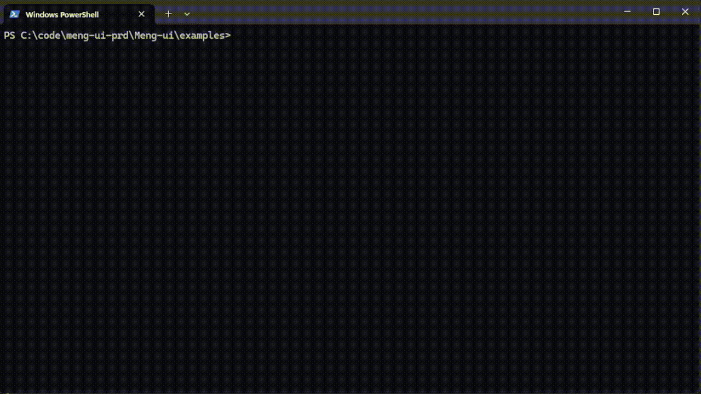

# Meng-ui

Meng-ui is a simple Python library for creating and manipulating terminal-based graphical interfaces using text and ANSI escape codes. 
This package allows you to build colorful and interactive ui's in your terminal.


### Installation

You can install the package by cloning the repository and using pip:

```
git clone https://github.com/Maty-0/Meng-ui.git
cd meng-ui
pip install -e .
```
 

### goals
- [ ] Upload package to PyPI
- [x] Cross-Platform Compatibility
- [ ] Community Engagement
- [ ] Create Tutorials